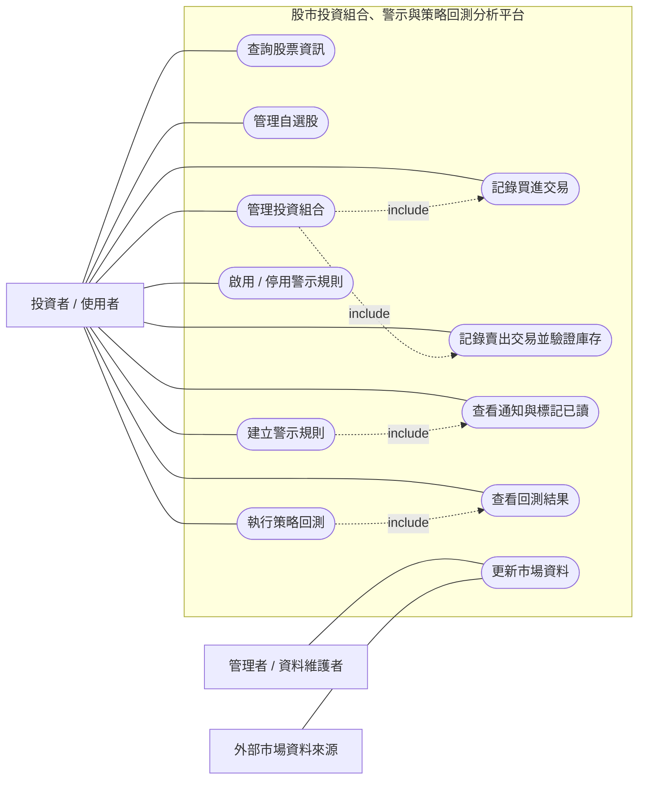
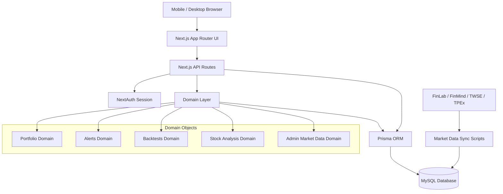
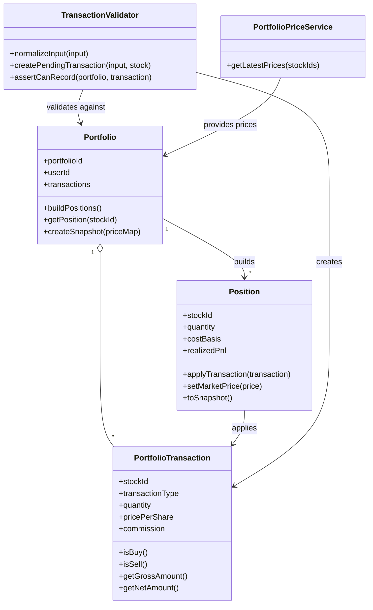
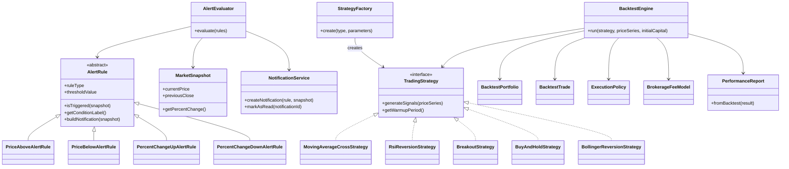
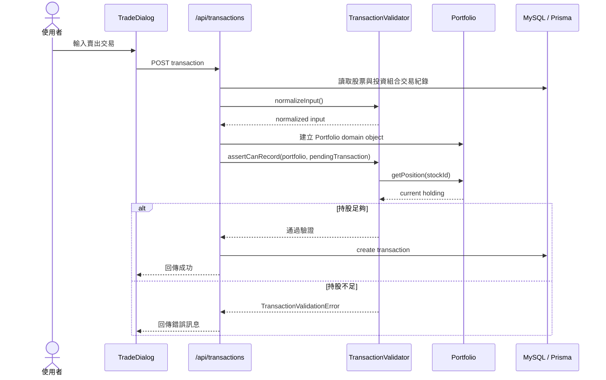

# 股市投資組合、警示與策略回測分析平台

**課程：** CSC0005 Object-Oriented Analysis and Design  
**組員：** 林冠宇、吳秉翰、謝宇宸、李亮廷  
**系統類型：** Web application designed to be displayed in a mobile web browser  
**版本：** Final Report Draft

## 摘要

本專題實作一套股市投資組合、警示與策略回測分析平台。系統以 Next.js App Router 作為 web application 架構，透過 Prisma ORM 存取 MySQL 資料庫，並使用 NextAuth.js 處理使用者登入與權限控制。使用者可以查詢股票資訊、管理自選股、建立投資組合、記錄買賣交易、設定價格或漲跌幅警示、查看通知，並執行不同交易策略的歷史回測。管理者可以透過後台維護市場資料，補齊股票、歷史價格、財報、股利與 ETF 相關資料。

本專題在 checkpoint 後依照老師回饋修正方向：原本功能偏向股票資料查詢與 CRUD 操作，後續改為以領域物件與規則流程為核心的投資分析平台。投資組合、警示通知與策略回測三個主要 domain 都已從 API route 中抽離出獨立物件，使系統更符合物件導向分析與設計精神。

組員分工如下：

| 組員 | 主要負責內容 |
| --- | --- |
| 吳秉翰 | MySQL 資料庫重建、Prisma schema、市場資料 API、FinLab 與公開資料匯入 |
| 林冠宇 | 投資組合 domain、交易驗證、投資組合 UI、交易與持股流程 |
| 謝宇宸 | 警示與通知 domain、AlertRule 設計、通知流程、use case 與 UML 圖 |
| 李亮廷 | 策略回測 domain、Backtests UI、設計模式整理、簡報與報告整合 |

## 需求與使用案例

系統主要 actor 包含一般投資者、管理者，以及外部市場資料來源。依課程要求，本組四人至少需要 8 個 use cases。本專題整理 11 個主要 use cases，並且多數已對應到實際 UI、API route 與 domain object。



| Use Case | 說明 | 主要實作位置 |
| --- | --- | --- |
| 查詢股票資訊 | 查詢股票基本資料、價格走勢、財務資料與 ETF 資訊 | `app/(dashboard)/stocks`, `api/stocks` |
| 管理自選股 | 新增、移除與檢查關注股票 | `app/(dashboard)/watchlist`, `api/watchlist` |
| 管理投資組合 | 建立、重新命名、刪除與查看投資組合 | `app/(dashboard)/portfolios`, `api/portfolios` |
| 記錄買進交易 | 將買進交易加入投資組合並更新持股 | `TradeDialog`, `api/transactions` |
| 記錄賣出交易並驗證庫存 | 賣出前檢查持股是否足夠，避免非法交易 | `TransactionValidator`, `Position` |
| 建立警示規則 | 建立價格高於、低於、漲幅、跌幅等警示 | `app/(dashboard)/alerts`, `api/alerts` |
| 啟用 / 停用警示規則 | 管理警示生命週期 | `api/alerts/[alertId]` |
| 查看通知與標記已讀 | 顯示觸發警示後產生的通知並更新狀態 | `api/notifications` |
| 執行策略回測 | 根據策略與參數模擬歷史交易 | `BacktestEngine`, `api/backtests` |
| 查看回測結果 | 顯示報酬率、最大回撤、勝率、交易紀錄與 equity curve | `app/(dashboard)/backtests` |
| 更新市場資料 | 管理者同步市場資料並檢查資料品質 | `app/(dashboard)/admin/market-data` |

## 系統架構

本系統採用 web application 架構，目標是能在桌面與 mobile web browser 中操作。使用者透過瀏覽器進入 Next.js UI，頁面呼叫 Next.js API Routes，API 層負責 session 驗證、參數解析與資料持久化，核心規則與計算則交給 domain objects。資料層透過 Prisma ORM 操作 MySQL。市場資料由 FinLab、FinMind、TWSE 與 TPEx 等來源匯入或增量更新。



## 資料儲存設計

資料表可分為五類。第一類是市場資料，包含 `stocks`、`historicalprices`、`financialreports`、`dividends`、`stocksplits`、`etfprofiles`、`etfnavsnapshots` 與 `etfholdings`。第二類是使用者資料，包含 `users` 與 NextAuth 相關登入資訊。第三類是投資組合資料，包含 `watchlistitems`、`portfolios` 與 `transactions`。第四類是警示與通知資料，包含 `alertrules` 與 `notifications`。第五類是策略回測資料，包含 `backtestruns` 與 `backtesttrades`。

這些資料表並非只用於 CRUD。執行期間，市場資料會被 `PortfolioPriceService`、`AlertMarketDataService` 與 `BacktestMarketDataService` 讀取；交易資料會被 `Portfolio`、`Position` 與 `TransactionValidator` 轉換成持股狀態；警示規則會經由 Factory 建立成可執行的 `AlertRule` 物件；回測資料則由 `BacktestEngine`、策略物件與 `PerformanceReport` 產生。

## 分析與設計技術

### 投資組合類別圖

投資組合 domain 的核心是 `Portfolio`。它聚合交易紀錄，建立多個 `Position`，並根據最新價格產生投資組合快照。`TransactionValidator` 負責交易前驗證，尤其是賣出交易不能超過目前持股。這樣設計可避免把交易規則散落在 UI 或 API route 中。



### 警示與回測類別圖

警示 domain 使用 `AlertRule` 作為抽象父類別，不同規則實作各自的判斷方法。`AlertEvaluator` 將規則與市場快照比對，若觸發則交由 `NotificationService` 建立通知。回測 domain 則由 `TradingStrategy` 與多個具體策略負責產生交易訊號，`BacktestEngine` 負責模擬買賣、建立 equity curve 與交易紀錄，最後由 `PerformanceReport` 計算績效指標。



### 執行策略回測活動圖

策略回測是本專題最能展現物件互動的 use case。它包含表單輸入、參數驗證、資料載入、策略建立、訊號產生、交易模擬與績效計算等步驟，不只是單純新增一筆資料。

```mermaid
flowchart TD
    start([開始])
    input[使用者輸入股票、期間、策略、參數與初始資金]
    validate{參數有效?}
    invalid[顯示驗證錯誤]
    load[BacktestMarketDataService 載入歷史價格]
    enough{歷史資料足夠?}
    insufficient[提示使用者調整區間或參數]
    factory[StrategyFactory 建立具體策略物件]
    signal[策略產生買賣訊號]
    engine[BacktestEngine 模擬交易]
    report[PerformanceReport 計算績效]
    save[儲存 BacktestRun 與 BacktestTrade]
    show[顯示 equity curve、績效摘要與交易明細]
    end([結束])

    start --> input --> validate
    validate -- 否 --> invalid --> end
    validate -- 是 --> load --> enough
    enough -- 否 --> insufficient --> end
    enough -- 是 --> factory --> signal --> engine --> report --> save --> show --> end
```

### 交易驗證 Sequence Diagram

賣出交易需要檢查目前持股是否足夠。此流程由 UI 發送請求，API 取得投資組合交易紀錄並建立 `Portfolio`，再由 `TransactionValidator` 判斷是否可記錄交易。



## 設計模式與物件導向原則

### Strategy Pattern

**Intent.** Strategy Pattern 的目的，是將可替換的演算法封裝在共同介面或抽象類別之後，使主要流程不需要依賴具體演算法。

**Structure.** 本專題有兩個主要使用位置。第一是警示規則，`AlertRule` 定義共同介面，`PriceAboveAlertRule`、`PriceBelowAlertRule`、`PercentChangeUpAlertRule` 與 `PercentChangeDownAlertRule` 實作不同判斷方式。第二是回測策略，`TradingStrategy` 定義共同行為，具體策略包含 `MovingAverageCrossStrategy`、`RsiReversionStrategy`、`BreakoutStrategy`、`BuyAndHoldStrategy`、`MovingAverageCrossWithStopLossStrategy` 與 `BollingerReversionStrategy`。

**Consequences.** 使用 Strategy Pattern 後，`AlertEvaluator` 與 `BacktestEngine` 不需要知道每種規則或策略的內部細節。新增警示類型或回測策略時，可以新增具體類別並透過 Factory 建立，降低修改既有流程的風險，也更符合 Open-Closed Principle。

### Factory Pattern

**Intent.** Factory Pattern 的目的，是集中物件建立邏輯，讓上層流程不直接依賴具體類別。

**Structure.** 警示 domain 使用 `createAlertRule(ruleRecord)`，將資料庫中的 `alertrules` record 轉換成具體 `AlertRule` 物件。回測 domain 使用 `StrategyFactory.create({ type, parameters })`，根據策略類型建立對應的策略物件。

**Consequences.** Factory 將建立邏輯從 API route 移出，使 API route 保持在 request handling 與 persistence 的責任範圍。當新增 `RSI_REVERSION`、`BREAKOUT` 或 `BOLLINGER_REVERSION` 等策略時，主要修改點集中在 Factory 與新策略類別，而不需要大幅調整 `BacktestEngine`。

### Object-Oriented Principles

本專題也應用多個物件導向原則。Single Responsibility Principle 體現在 `Portfolio` 負責整理交易與持股，`Position` 負責單一股票部位計算，`TransactionValidator` 負責交易驗證，`PerformanceReport` 負責績效指標。Open-Closed Principle 體現在警示規則與回測策略可透過新增具體類別擴充。Dependency Inversion 的精神體現在 `BacktestEngine` 依賴 strategy 的共同行為，而非依賴單一具體策略。

## 完成度

目前系統已完成核心功能並可成功 build。已完成項目包含：使用者註冊登入、Google OAuth、儀表板、股票搜尋與個股頁、自選股、投資組合管理、買賣交易、警示規則、通知、策略回測、回測結果比較、管理員市場資料維護、FinLab 匯入、免費資料來源備援與公開來源增量同步。系統的主要頁面均已整合到 dashboard layout，並以 responsive UI 支援手機瀏覽器展示。

尚未完全自動化的部分包括正式部署環境設定、定期排程警示評估，以及影片繳交頁面的公開連結設定。這些項目不影響目前本機展示，但在期末繳交前需要確認。

## 挑戰與解法

本專題最大的挑戰是將原本偏 CRUD 的股票查詢網站，改造成能展現物件導向分析與設計的系統。若所有邏輯都寫在 API route 或 page component 中，雖然功能可用，但很難在報告中說明物件責任、互動與設計模式。

我們的解法是將核心規則抽離成 domain objects。投資組合中，交易、持股、已實現損益與未實現損益交給 `Portfolio`、`Position` 與 `PortfolioTransaction` 處理；賣出限制交給 `TransactionValidator`。警示中，不同條件由不同 `AlertRule` 子類別處理，評估流程交給 `AlertEvaluator`。回測中，策略訊號由策略物件產生，交易模擬由 `BacktestEngine` 執行，績效統計由 `PerformanceReport` 整理。這樣讓系統設計和 UML 圖能直接對應到 source code。

另一個挑戰是市場資料來源。股票、歷史價格與財報資料量大，且資料來源可能有 token、頻率限制或缺漏。系統因此設計管理員市場資料維護模組，支援 FinLab 優先、免費來源備援與 TWSE/TPEx 公開來源增量同步，並記錄同步工作與資料品質檢查結果。

## 結論

本專題完成一套以物件導向設計為核心的股市投資分析 web application。系統不只提供股票資料查詢，也支援投資組合計算、交易驗證、警示規則、通知流程與多策略回測。透過 Strategy Pattern、Factory Pattern 與 domain layer 重構，專題從單純資料操作提升為規則與策略驅動的平台，符合 OOAD 課程對 use cases、UML diagrams、design patterns 與 source code 一致性的要求。

## References

1. Next.js Documentation, https://nextjs.org/docs
2. Prisma Documentation, https://www.prisma.io/docs
3. NextAuth.js Documentation, https://next-auth.js.org/
4. React Documentation, https://react.dev/
5. FinLab Python Package and Data Service, https://finlab.tw/
6. Taiwan Stock Exchange Open Data, https://www.twse.com.tw/
7. Taipei Exchange Open Data, https://www.tpex.org.tw/
8. Erich Gamma, Richard Helm, Ralph Johnson, John Vlissides, *Design Patterns: Elements of Reusable Object-Oriented Software*, Addison-Wesley, 1994.

## Appendix A：程式碼結構

```text
Stock-Query-Website/
├─ README.md
├─ OOAD_UseCase_Roadmap.md
├─ docs/final-report/OOAD_Final_Report.md
└─ frontend/
   ├─ app/
   │  ├─ (auth)/
   │  ├─ (dashboard)/
   │  └─ api/
   ├─ components/
   ├─ contexts/
   ├─ lib/
   │  ├─ domain/
   │  │  ├─ admin/
   │  │  ├─ alerts/
   │  │  ├─ backtests/
   │  │  ├─ portfolio/
   │  │  └─ stocks/
   │  ├─ auth-utils.js
   │  └─ prisma.js
   ├─ prisma/
   │  ├─ schema.prisma
   │  └─ migrations/
   └─ scripts/
```

## Appendix B：關鍵程式碼索引

| Domain | Key Files |
| --- | --- |
| Portfolio | `frontend/lib/domain/portfolio/Portfolio.js`, `Position.js`, `PortfolioTransaction.js`, `TransactionValidator.js`, `PortfolioPriceService.js` |
| Alerts | `frontend/lib/domain/alerts/rules.js`, `AlertEvaluator.js`, `AlertMarketDataService.js`, `NotificationService.js`, `MarketSnapshot.js` |
| Backtests | `frontend/lib/domain/backtests/BacktestEngine.js`, `PerformanceReport.js`, `BacktestMarketDataService.js`, `strategies/StrategyFactory.js`, `execution/BacktestPortfolio.js` |
| Admin Market Data | `frontend/lib/domain/admin/MarketDataSyncJob.js`, `MarketDataStatusService.js`, `MarketDataQualityService.js` |
| API Routes | `frontend/app/api/transactions/route.js`, `api/alerts/route.js`, `api/backtests/route.js`, `api/admin/market-data/sync/route.js` |
| UI Pages | `frontend/app/(dashboard)/stocks`, `watchlist`, `portfolios`, `alerts`, `backtests`, `admin/market-data` |

## Appendix C：建置與驗證

本專題於開發環境執行以下指令驗證：

```bash
cd frontend
npm run lint
npm run build
```

目前 lint 通過，production build 可成功完成。build 過程中 Next.js 顯示一則 ESLint parser serialization 訊息，但編譯、靜態頁面產生與 route tracing 皆成功完成。
